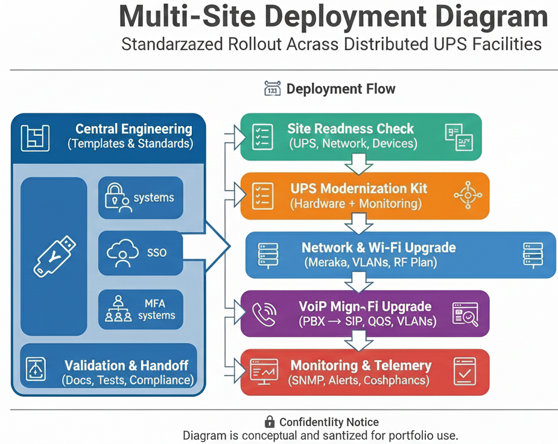

# Architecture Diagram  
**Multi‑Site UPS & Infrastructure Modernization Program**

This document provides the primary architectural visualization for the multi‑site modernization initiative.  
It represents the standardized deployment flow used across ~10 UPS facilities, including UPS upgrades, network modernization, VoIP migration, and telemetry integration.

---

## 📊 Multi‑Site Deployment Architecture

The following diagram illustrates the end‑to‑end modernization flow:

---

## 🧩 Diagram Overview

### **1. Central Engineering**
- Defines modernization templates and deployment standards  
- Provides SNMP profiles, UPS baselines, and network configurations  
- Coordinates multi‑site rollout sequencing  

### **2. Site Readiness Assessment**
- Evaluates UPS age, battery health, and bypass panel condition  
- Reviews Wi‑Fi coverage, switch capacity, and VLAN structure  
- Identifies OT devices (SICK lasers, encoders, sensors)  
- Confirms maintenance windows and operational constraints  

### **3. UPS Modernization Kit**
- Standardized UPS hardware and battery modules  
- SNMP monitoring cards for runtime and load telemetry  
- Environmental sensors (temperature, humidity)  
- Installation and validation checklist  

### **4. Network & Wi‑Fi Upgrade**
- Meraki switching and AP deployment  
- VLAN segmentation for voice, cameras, OT, and corporate devices  
- RF redesign for warehouse/logistics zones  
- PoE provisioning for cameras, VoIP phones, and sensors  

### **5. VoIP Migration**
- PBX → SIP transition  
- QoS enforcement for voice traffic  
- VLAN isolation and DHCP scope updates  
- Device provisioning and endpoint validation  

### **6. Monitoring & Telemetry**
- SNMP polling for UPS runtime, load, and battery health  
- Alert thresholds for temperature, voltage, and runtime  
- Dashboard integration (sanitized)  
- Automated health checks and reporting  

### **7. Validation & Handoff**
- Compliance checks and documentation updates  
- Network, UPS, and VoIP validation tests  
- Operational readiness sign‑off with site leadership  
- Final handoff to UPS IT and facilities teams  

---

## 🔒 Confidentiality Notice
This diagram and description are sanitized for portfolio use.  
No internal UPS schematics, credentials, or proprietary details are included.
