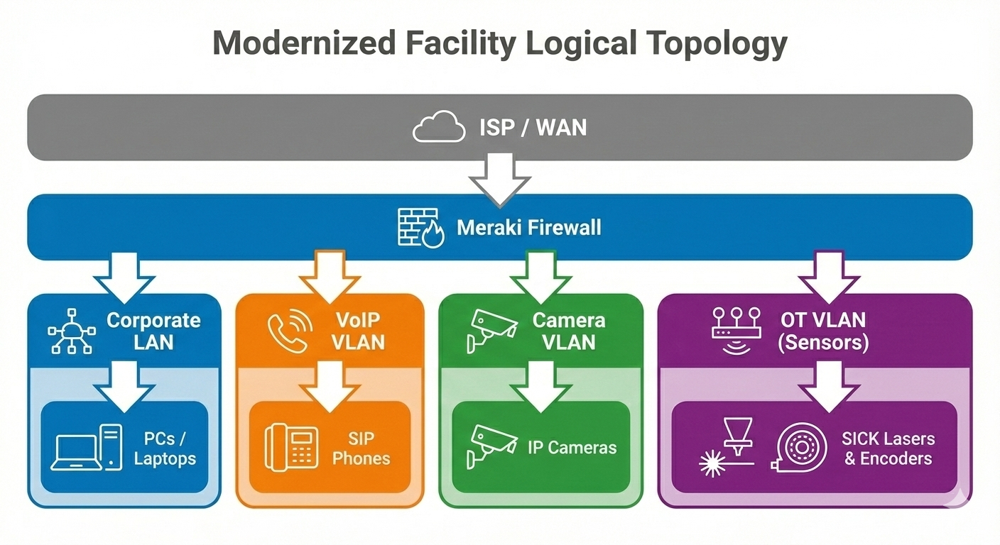

# 🖧 Network Topology  
**Facility‑Local Network Architecture for Multi‑Site UPS Modernization**

This document provides a high‑level view of the standardized network topology deployed across UPS facilities as part of the modernization program.  
It reflects the unified design used for Wi‑Fi expansion, VLAN segmentation, VoIP migration, camera support, and OT device integration.

---

## 🗺️ Facility Network Architecture Diagram

The following diagram represents the generalized network layout used across all modernized UPS sites:

---

## 🌐 Core Network Components

### 🔀 **Cisco Meraki Switching & Routing**
- Centralized cloud‑managed configuration  
- Layer 2/Layer 3 switching  
- PoE distribution for cameras, VoIP, and sensors  
- Firewall segmentation for corporate, OT, and voice networks  

### 📶 **Wi‑Fi Infrastructure**
- Meraki APs deployed across warehouse, logistics, and office zones  
- RF redesign to eliminate dead zones  
- Dedicated SSIDs for corporate, guest, and OT devices  
- WPA2/WPA3 enterprise authentication  

### 🧩 **VLAN Segmentation**
To ensure security, performance, and traffic isolation:

| VLAN | Purpose |
|------|---------|
| 🖥️ **Corporate LAN** | PCs, laptops, servers |
| ☎️ **Voice VLAN** | SIP phones, VoIP gateways |
| 🎥 **Camera VLAN** | IP cameras, NVR systems |
| 🏭 **OT VLAN** | SICK lasers, encoders, industrial sensors |
| 🌐 **Guest VLAN** | Isolated internet‑only access |

---

## 🔄 Logical Traffic Flow

### 🖥️ **Corporate Traffic**
- Routed through Meraki firewall  
- Access to internal services (sanitized)  
- Enforced content filtering and security policies  

### ☎️ **Voice Traffic**
- Prioritized via QoS  
- Segmented into dedicated VLAN  
- SIP registration to VoIP gateway  

### 🎥 **Camera Traffic**
- Isolated from corporate network  
- Direct PoE connection to switches  
- Streams to NVR system  

### 🏭 **OT Traffic**
- Segmented for safety and reliability  
- Limited east‑west communication  
- Used for SICK laser and encoder telemetry  

---

## 🔐 Security Controls

### 🛡️ **Firewall Policies**
- Strict inter‑VLAN rules  
- Blocked lateral movement between OT and corporate networks  
- Controlled access to VoIP and camera systems  

### 🔑 **Access Control**
- MAC‑based policies for OT devices  
- 802.1X for corporate endpoints  
- Guest network isolation  

### 📡 **Monitoring**
- SNMP telemetry for switches, APs, and UPS units  
- Alerting for link failures, AP outages, and PoE load issues  

---

## 🔒 Confidentiality Notice
This topology is generalized and sanitized for portfolio use.  
No internal UPS network details, IP ranges, or proprietary configurations are included.
